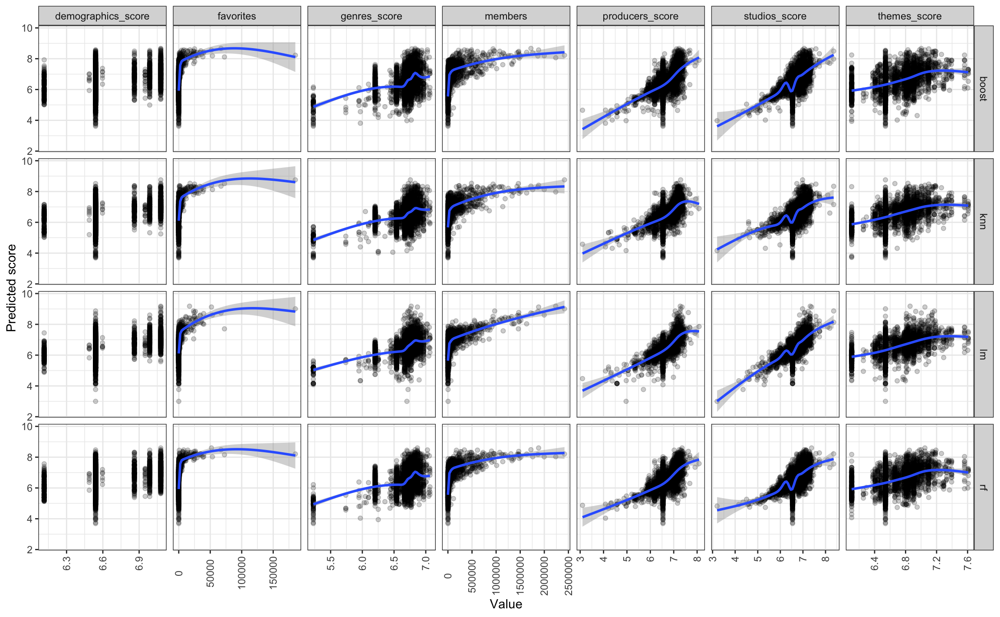

# Predicting Anime Scores on MyAnimeList

This interactive Shiny app allows a user to enter a URL for an anime page on [MyAnimeList](https://myanimelist.net/) (MAL), an anime and manga database, and get back its predicted score using several regression models: linear regression, k-nearest neighbors, boosted trees, and random forest.

[Add centered image here]

## Skills

- Preprocessing data with the **tidyverse**
- Visualizing data with **ggplot2** (static plots) and **ggiraph** (interactive plots)
- Building machine learning models with **tidymodels**
- Scraping MAL sites with **rvest**
- Creating an interactive app with **Shiny**

## Challenges

- Dealing with variables with multiple labels (mapped them to numeric scores)
- Figuring out how to use Shiny (designing the UI, updating inputs based on the URL, organizing functions into separate scripts)

## Results

### Model performance (test RMSE)

- **Linear regression:** 0.606
- **K-nearest neighbors:** 0.581
- **Boosted trees:** 0.438 (best)
- **Random forest:** 0.449

### Visuals

### Numeric variables

- Producers, studios, themes, genres, and demographics with higher average scores also tended to have higher predicted scores
- The number of members and favorites were each correlated with predicted scores, though the effect of these variables eventually reach a plateau

### Categorical variables

Category | Lower predicted scores | Higher predicted scores
:--|:--|:--
Source | web novels, light novels, manga | music, radio
Type | TV, movie | music, ONA
Rating | R, PG-13 | Rx (hentai), G
